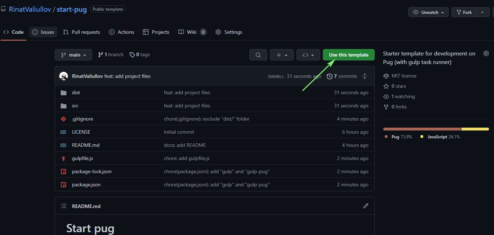

# Start pug

## Overview 

This is a very simple starter kit for development on [Pug](https://pugjs.org) template engine that uses the [gulp](https://gulpjs.com) task runner and [gulp-pug](https://github.com/gulp-community/gulp-pug) plugin to compile Pug templates.

## Quickstart

### Choose your preferred option:

- You can immediately download the [zip](https://github.com/RinatValiullov/start-pug/archive/refs/heads/main.zip) files.

- Or you can create a repository from this template. Find the `Use this template` button in the upper right corner and click it. Then you can choose your own repo name, description and other functions:



- Or you can clone this repository:

1. Paste this command in your terminal:

```
git clone https://github.com/RinatValiullov/start-pug.git my-app
```

2. Go to `my-app` directory:

```
cd my-app
```

3. Install all required development dependencies via [npm](https://docs.npmjs.com) or [yarn](https://yarnpkg.com/getting-started):

```
npm install
```
or
```
yarn install
```

4. Start the project:

```
npm start
```
or
```
yarn start
```

5. For more convenient development go to your favorite code editor or IDE.

## File structure

```
- dist/
    - assets/
        - images/
        - fonts/
    - scripts/
        - main.js
    - styles/
        - main.css
        - reset.css
    - index.html
- src/
    - includes/
        - _footer.pug
        - _header.pug
    - layouts
        - _main.pug
    - index.pug
.gitignore
LICENSE
gulpfile.js
package.json
README.md
```

## If you have any questions you can always [contact me](https://t.me/fredddie).
## If you have any suggestions or you want to make the template a little better, you can always create an [Issue](https://github.com/RinatValiullov/start-pug/issues/new) or [PR](https://github.com/RinatValiullov/start-pug/pulls). 
